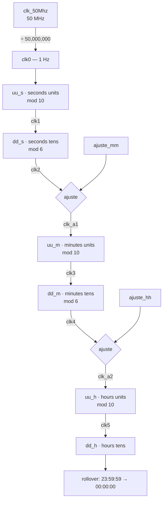

# clock-digital

A 24-hour digital clock in VHDL, running on a **Terasic DE10-Lite** (Intel/Altera MAX 10). The time shows on the board's six seven-segment displays as `hh:mm:ss`, and the hours and minutes can be set from the board without reprogramming it.

---

## Demo

<a href="https://www.youtube.com/shorts/gfCbWPkYEDI">
  
</a>

[youtube.com/shorts/gfCbWPkYEDI](https://www.youtube.com/shorts/gfCbWPkYEDI)

---

## Hardware

| | |
| --- | --- |
| Board | Terasic DE10-Lite |
| FPGA | Intel MAX 10 — `10M50DAF484C7G` |
| Clock | 50 MHz oscillator (`MAX10_CLK1_50`) |
| Display | `HEX5 HEX4` : `HEX3 HEX2` : `HEX1 HEX0` → hours : minutes : seconds |
| Toolchain | Intel Quartus Prime Lite |

`HEX0` is the rightmost display on the board, so seconds sit on the right and hours on the left — the natural reading order.

---

## How it works

The design is a chain of counters. A prescaler turns the 50 MHz board clock into 1 Hz, and each digit's carry-out clocks the next digit. Seconds and minutes are mod-10 / mod-6 pairs; the hour pair rolls over at 24.



**The prescaler.** A counter runs to `max = 50_000_000` and `clk0` is driven low for the first half and high for the second, producing a 1 Hz square wave with a 50 % duty cycle.

**The rollover.** Hours are not a plain mod-24 counter. The units and tens digits count independently, and a separate check clears both the moment they read `2` and `4` — so the display steps from `23:59:59` straight to `00:00:00`.

**Setting the time.** The `ajuste` input is a mode switch. Each of the two multiplexers picks between the normal carry from the digit below and a manual pulse:

```vhdl
clk_a1 <= (clk2 and not ajuste_sync) or (ajuste_mm and ajuste_sync);
clk_a2 <= (clk4 and not ajuste_sync) or (ajuste_hh and ajuste_sync);
```

With `ajuste` low the clock runs normally. With it high, the seconds keep counting but the minute and hour digits advance from `ajuste_mm` and `ajuste_hh` instead. `ajuste` is resampled into `ajuste_sync` on the falling edge of `clk0`, so switching modes does not land in the middle of a carry.

---

## Interface

| Port | Dir | Width | Meaning |
| --- | --- | --- | --- |
| `clk_50Mhz` | in | 1 | 50 MHz board oscillator |
| `reset` | in | 1 | **Active low** — asynchronous, clears all six digits to `00:00:00` |
| `ajuste` | in | 1 | Set mode. Low = run, high = set |
| `ajuste_hh` | in | 1 | While setting, each rising edge advances the hours |
| `ajuste_mm` | in | 1 | While setting, each rising edge advances the minutes |
| `hex0` … `hex5` | out | 7 | Seven-segment outputs, **active low**, bit 0 = segment `a` … bit 6 = segment `g` |

*ajuste* is Spanish for *adjust*; `uu_`/`dd_` prefixes in the source mark the units and tens digit of each field.

### Segment encoding

The `numero` function is a plain decoder. Outputs are active low, matching the common-anode displays on the DE10-Lite — a `0` lights a segment:

| Digit | `abcdefg` | | Digit | `abcdefg` |
| --- | --- | --- | --- | --- |
| 0 | `0000001` | | 5 | `0100100` |
| 1 | `1001111` | | 6 | `1100000` |
| 2 | `0010010` | | 7 | `0001111` |
| 3 | `0000110` | | 8 | `0000000` |
| 4 | `1001100` | | 9 | `0000100` |

---

## Building it

This repository holds the VHDL source only — **no Quartus project file is included**, so the first step is creating one and assigning pins.

1. In Quartus Prime, create a new project targeting **`10M50DAF484C7G`**.
2. Add `clock_dig.vhd` and set `clock_dig` as the top-level entity.
3. Assign the pins (below), then **Processing → Start Compilation**.
4. Program the board over USB-Blaster with **Tools → Programmer**, loading the generated `.sof`.

### Pin assignments

Paste into the project's `.qsf`. **Check these against the DE10-Lite User Manual before programming** — Terasic's `DE10_LITE_Golden_Top.qsf` is the authoritative source, and a mis-assigned pin can drive an output against the board.

```tcl
set_location_assignment PIN_P11 -to clk_50Mhz     ;# MAX10_CLK1_50
set_location_assignment PIN_B8  -to reset         ;# KEY0, active low
set_location_assignment PIN_C10 -to ajuste        ;# SW0
set_location_assignment PIN_C11 -to ajuste_hh     ;# SW1
set_location_assignment PIN_D12 -to ajuste_mm     ;# SW2

set_location_assignment PIN_C14 -to hex0[0]
set_location_assignment PIN_E15 -to hex0[1]
set_location_assignment PIN_C15 -to hex0[2]
set_location_assignment PIN_C16 -to hex0[3]
set_location_assignment PIN_E16 -to hex0[4]
set_location_assignment PIN_D17 -to hex0[5]
set_location_assignment PIN_C17 -to hex0[6]

set_location_assignment PIN_C18 -to hex1[0]
set_location_assignment PIN_D18 -to hex1[1]
set_location_assignment PIN_E18 -to hex1[2]
set_location_assignment PIN_B16 -to hex1[3]
set_location_assignment PIN_A17 -to hex1[4]
set_location_assignment PIN_A18 -to hex1[5]
set_location_assignment PIN_B17 -to hex1[6]

set_location_assignment PIN_B20 -to hex2[0]
set_location_assignment PIN_A20 -to hex2[1]
set_location_assignment PIN_B19 -to hex2[2]
set_location_assignment PIN_A21 -to hex2[3]
set_location_assignment PIN_B21 -to hex2[4]
set_location_assignment PIN_C22 -to hex2[5]
set_location_assignment PIN_B22 -to hex2[6]

set_location_assignment PIN_F21 -to hex3[0]
set_location_assignment PIN_E22 -to hex3[1]
set_location_assignment PIN_E21 -to hex3[2]
set_location_assignment PIN_C19 -to hex3[3]
set_location_assignment PIN_C20 -to hex3[4]
set_location_assignment PIN_D19 -to hex3[5]
set_location_assignment PIN_E17 -to hex3[6]

set_location_assignment PIN_F18 -to hex4[0]
set_location_assignment PIN_E20 -to hex4[1]
set_location_assignment PIN_E19 -to hex4[2]
set_location_assignment PIN_J18 -to hex4[3]
set_location_assignment PIN_H19 -to hex4[4]
set_location_assignment PIN_F19 -to hex4[5]
set_location_assignment PIN_F20 -to hex4[6]

set_location_assignment PIN_J20 -to hex5[0]
set_location_assignment PIN_K20 -to hex5[1]
set_location_assignment PIN_L18 -to hex5[2]
set_location_assignment PIN_N18 -to hex5[3]
set_location_assignment PIN_M20 -to hex5[4]
set_location_assignment PIN_N19 -to hex5[5]
set_location_assignment PIN_N20 -to hex5[6]

set_global_assignment -name FAMILY "MAX 10"
set_global_assignment -name DEVICE 10M50DAF484C7G
set_global_assignment -name TOP_LEVEL_ENTITY clock_dig
set_global_assignment -name VHDL_FILE clock_dig.vhd
```

---

## Using it

| Action | Input |
| --- | --- |
| Reset to `00:00:00` | Press `KEY0` (drives `reset` low) |
| Run | `ajuste` low |
| Set the time | `ajuste` high, then pulse `ajuste_hh` / `ajuste_mm` |

Seconds keep counting while you set the time, so the clock does not lose track of the second boundary.

---

## Design notes

Three characteristics worth knowing before modifying this:

**It is a ripple counter, not a synchronous one.** Each digit is clocked by the carry of the digit below (`clk1` … `clk5`) rather than all digits sharing the 50 MHz clock with enables. That is a legitimate and compact way to build a clock, and it works on the board — but Quartus infers a derived clock per stage, so expect unconstrained-clock warnings from TimeQuest. At 1 Hz the ripple delay is irrelevant.

**Simulation will not match hardware.** The main process is sensitive to `clk0, reset, ajuste, ajuste_hh, ajuste_mm`, but the body also triggers on `clk1` … `clk5` edges. Synthesis infers registers from those `'event` constructs regardless, so the board behaves correctly — but an RTL simulator only re-evaluates the process when a signal in the sensitivity list changes, so the upper digits will appear not to advance. Add `clk1` … `clk5` to the sensitivity list if you want to simulate it.

**Reset is asynchronous and active low**, which suits the DE10-Lite push buttons directly — they read `0` when pressed, so `KEY0` needs no inverter.

---

## Files

```
clock_dig.vhd    the whole design: prescaler, counter chain, segment decoder
```

## Author

[@Galaviz1](https://github.com/Galaviz1)
